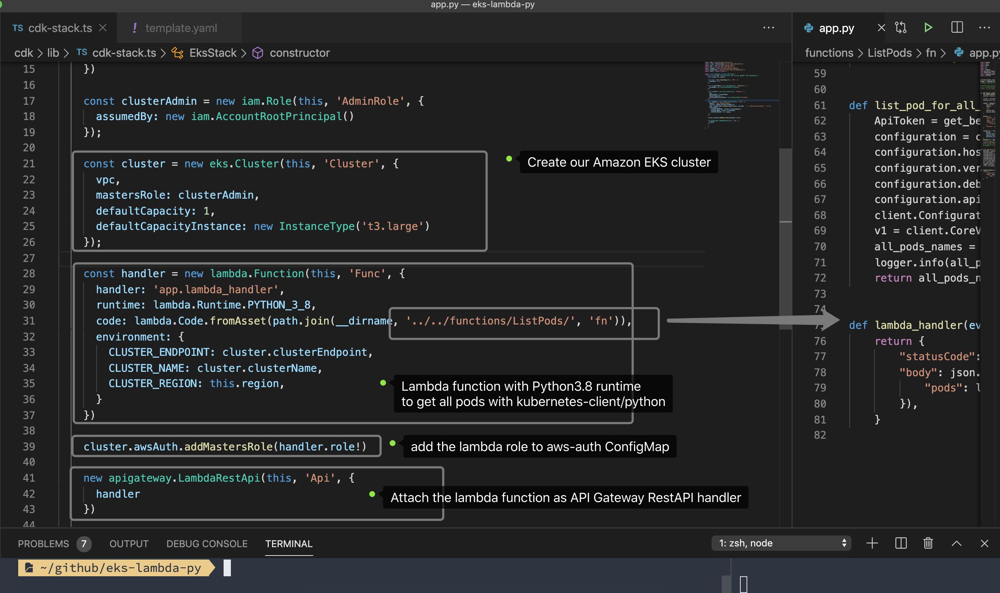
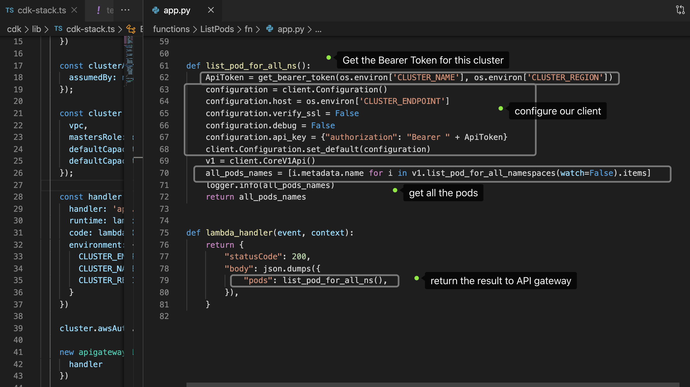
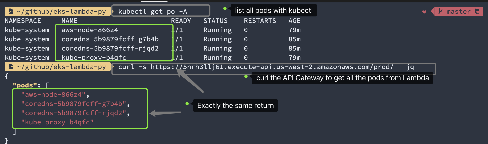

# eks-lambda-py

**eks-lambda-py** is an AWS CDK sample to demostrate how AWS Lambda function interact with Amazon EKS with **kubernetes-client/python** with Amazon EKS authentication.


```sh
# prepare the virtualenv for python3.8
$ cd functions/ListPods/
$ python3.8 -m venv .venv
$ source .venv/bin/activate
# install required python modules
$ cd fn
$ pip install -r requirements.txt -t .
# cdk deploy
$ cd ../../../cdk
$ cdk deploy
# on deploy completed follow the outputs and run the ClusterConfigCommand
$ aws eks update-kubeconfig --name YOUR_CLUSTER_NAME --region REGION --role-arn YOUR_ROLE_ARN
# list all the pods in all namespaces
$ kubectl get po -A                          master    
NAMESPACE     NAME                       READY   STATUS    RESTARTS   AGE
kube-system   aws-node-866z4             1/1     Running   0          70m
kube-system   coredns-5b9879fcff-g7b4b   1/1     Running   0          76m
kube-system   coredns-5b9879fcff-rjqd2   1/1     Running   0          76m
kube-system   kube-proxy-b4qfc           1/1     Running   0          70m
# curl the API to see the results from Lambda
$ curl -s https://5nrh3llj61.execute-api.us-west-2.amazonaws.co
m/prod/ | jq
{
  "pods": [
    "aws-node-866z4",
    "coredns-5b9879fcff-g7b4b",
    "coredns-5b9879fcff-rjqd2",
    "kube-proxy-b4qfc"
  ]
}
```






